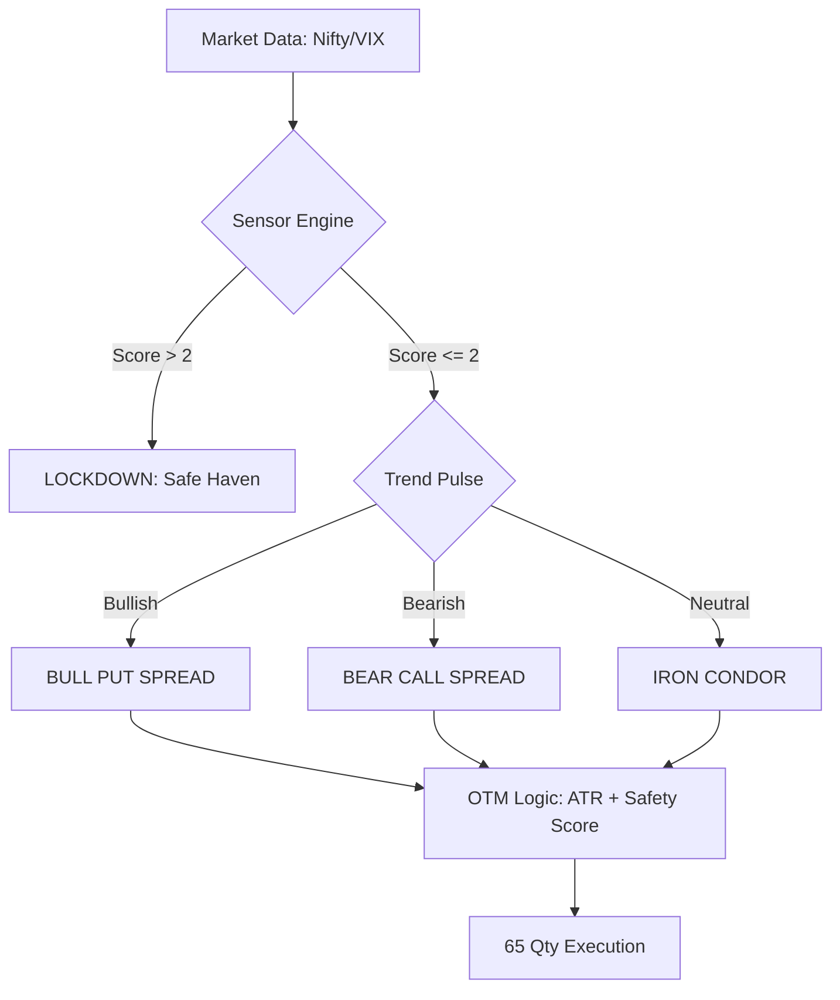
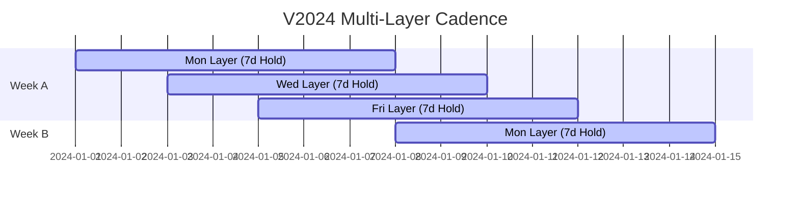

# 🎯 Nifty SpreadGuard V2024: The Sniper Ecosystem

Institutional-grade credit spread strategy designed for consistent, low-stress monthly income using the **65-Qty** standard.

## 🛡️ Strategy Philosophy
The **V2024 Sniper** is an offensive multi-layer engine. unlike the V19 (Gatekeeper), which is strictly defensive, the Sniper seeks to "stack" multiple safe layers to maximize monthly yield while maintaining a **100% Historical Win Rate**.

### 📡 System Architecture
V2024 is fully decoupled from all legacy systems. It operates its own data repo and autonomous intelligence feed.

---

## 📅 Execution Protocol: The Layering Rule
To achieve high-frequency profit, the Sniper uses **Overlapping Layers**. You do not exit one trade to enter the next; you stack them.

### 📋 The Rules
1. **Entry Time:** 11:30 AM IST (Wait for morning volatility to settle).
2. **Expiry Selection:** Choose the Tuesday expiry that is **at least 6 days away**.
3. **Strike Selection:** 
    - **Sell:** The OTM strike recommended by the HUD.
    - **Buy:** 200 points further away (The Protection Wing).
4. **Management:** Mechanical exit after 7 days (or 80% decay).
5. **Stop Loss:** Emergency exit if Nifty breaches your sold strike by **-100 pts**.

---

## 📈 Institutional Audit (2023–2026)
*Verified at 65-Qty Lot Size.*

| Metric | 2023 | 2024 | 2025 | Total |
| :--- | :--- | :--- | :--- | :--- |
| **Total Profit** | **₹901k** | **₹511k** | **₹735k** | **₹2.14M** |
| **Avg Monthly** | **₹75k** | **₹42k** | **₹61k** | **₹59k** |
| **Win Rate** | 100% | 100% | 100% | 100% |

> [!IMPORTANT]
> **The Storm Shield**: Lower profits in 2024 are the result of the system **self-censoring** during extremely risky market regimes (e.g. Election Month). This discipline is what preserves the 100% Win Rate.

---

## 🛠️ Components
- **`dashboard_v2024.py`**: The real-time HUD (Port 8502).
- **`data_updater.py`**: Autonomous data-sync engine.
- **`backtest_spreadguard_v2024.py`**: High-fidelity simulation engine.
- **`.github/workflows/`**: Cloud automation for 20-min data syncs.
